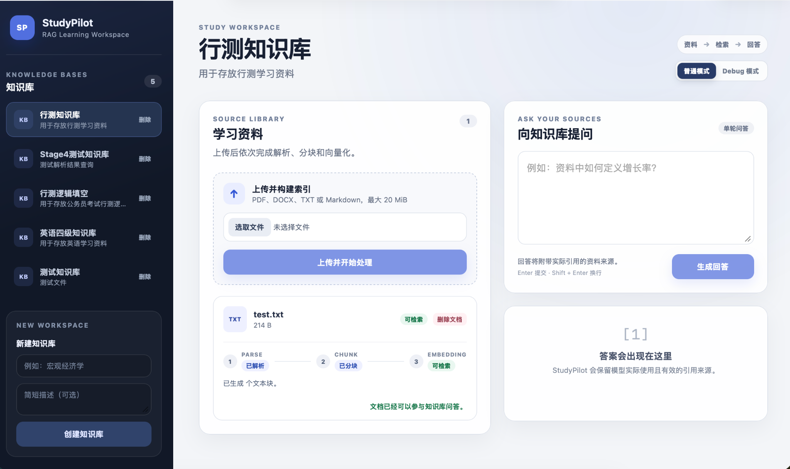
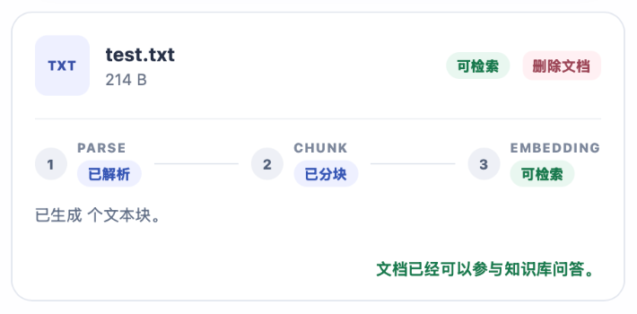
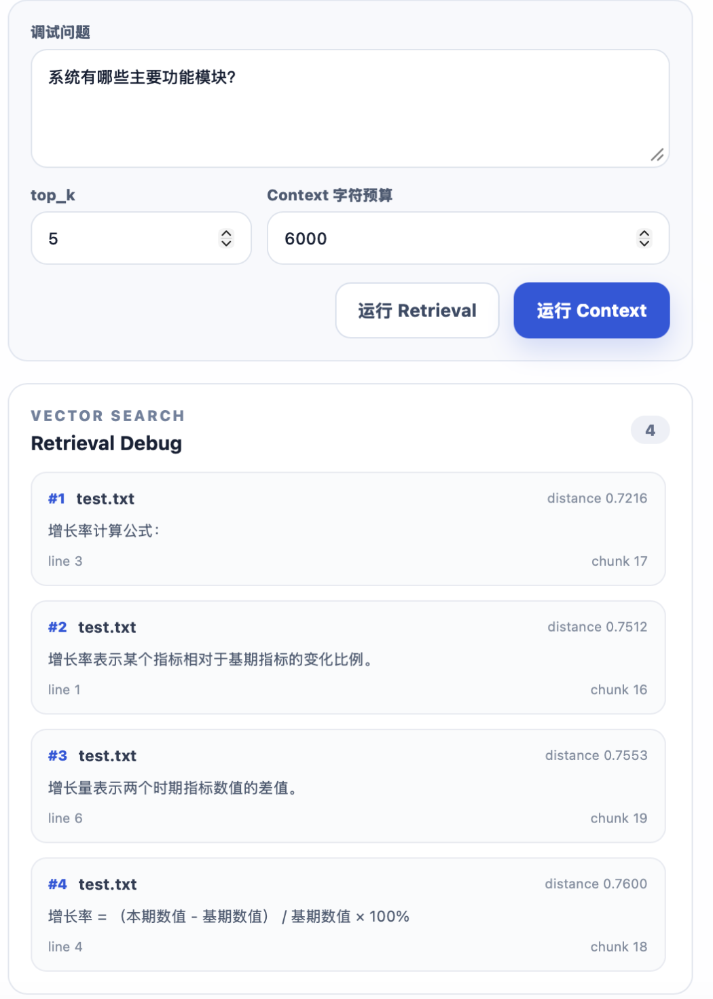
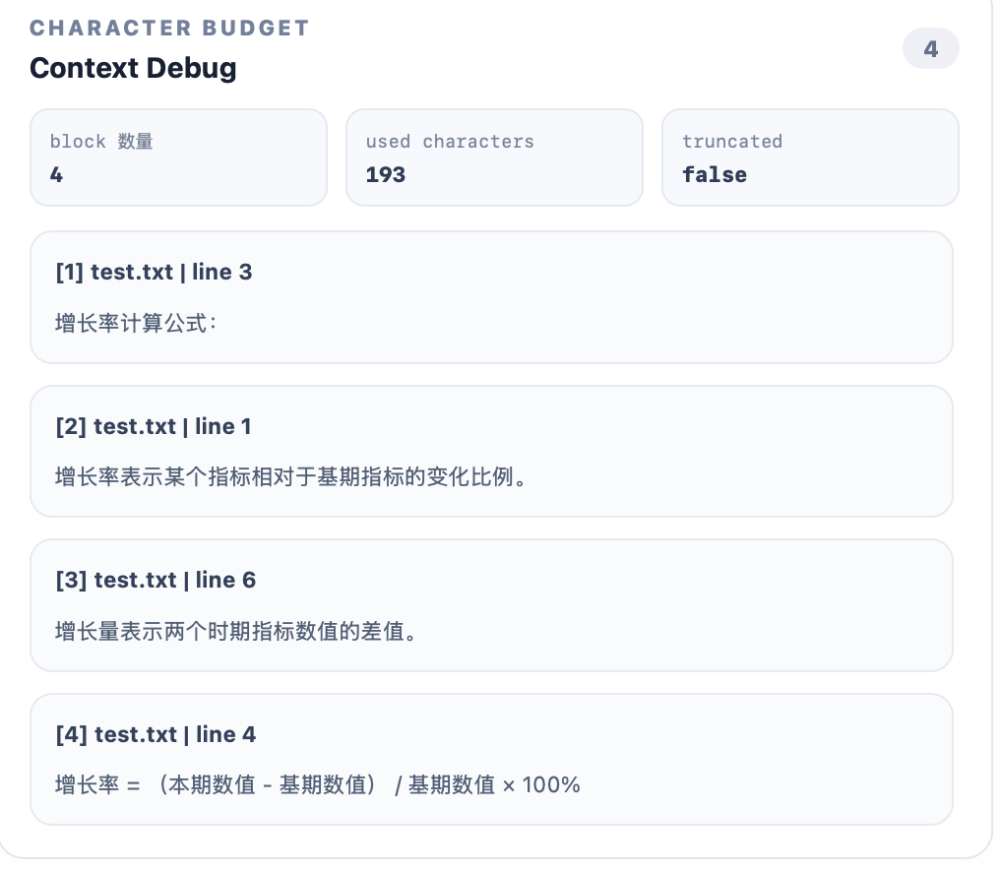

# StudyPilot Demo

以下截图展示 StudyPilot v1.0 RAG MVP 从知识库管理、文档处理到检索调试、上下文调试和引用回答的完整产品流程。

## 1. Workspace

工作台集中提供知识库选择、学习资料上传和知识库问答入口。

## 2. Document Pipeline

文档按照 Parse → Chunk → Embedding 的显式流程处理；完成向量化后进入可检索状态。

## 3. Retrieval Debug

Retrieval Debug 展示 top-k 检索结果、向量距离、Chunk 内容摘要以及页码、段落或行号等来源位置。

## 4. Context Debug

Context Debug 展示组装后的 Context Block、已使用字符数、字符预算以及 `truncated` 截断状态。

## 5. Answer + Citation

回答区域展示基于资料生成的 Grounded Answer，以及 Citation 编号、来源文件、距离和有效引用状态。
